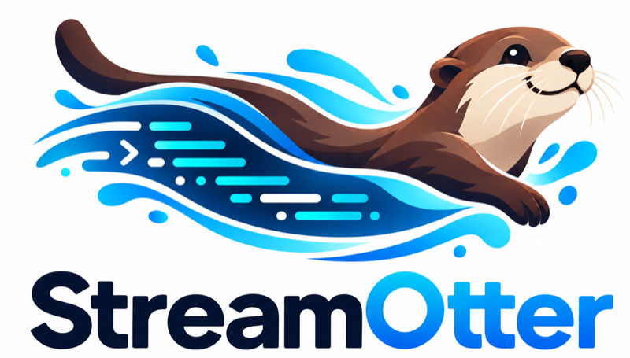

<p align="center"></p>

# StreamOtter

Make live data straightforward to build with, and understandable when it breaks.

[](https://www.npmjs.com/package/@streamotter/cli)
[](https://github.com/jfricano/StreamOtter/actions/workflows/ci.yml)
[](./LICENSE)

StreamOtter gets state from Kafka to the browser in a way you can trust. Browsers subscribe to **state channels**, not raw topics. Each view starts from an authoritative snapshot and then receives full-state updates in revision order. Every view is either verifiably `live` or visibly `stale`, never silently wrong after a disconnect, a restart, or a slow client. Your own handlers decide who may see what.

It is a Node.js gateway, a TypeScript browser SDK over Socket.IO, a CLI with a local workbench, and a TypeScript generator for your channels. It continues KafkaSocks' goal of simpler Kafka-to-frontend integration.

> **Status: release candidate.** `0.1.0-rc` versions are [on npm](https://www.npmjs.com/org/streamotter). The API may still change before `0.1.0`. What is verified, how, and the known limitations: [implementation status](./docs/IMPLEMENTATION_STATUS.md).

## Install

```bash
npm install streamotter
```

[`streamotter`](https://www.npmjs.com/package/streamotter) is everything in one install: the `streamotter` command, the gateway (`streamotter/gateway`), and the browser SDK (`streamotter/client`). A frontend that lives apart from the gateway can install just [`@streamotter/client`](https://www.npmjs.com/package/@streamotter/client). Node.js 24 or later for the gateway and CLI; current evergreen browsers for the SDK.

## Try it in five minutes

In a new folder; no Kafka needed, because the scaffold uses a built-in fixture source.

```bash
npm init -y
npm install streamotter
npx streamotter init .
npx streamotter dev --config streamotter.json --handlers server/handlers.mjs
```

Open the workbench URL that `dev` prints, paste its one-time token, then preview the `jobProgress` channel and advance the fixture to watch revisions arrive. [Getting started](./docs/guides/getting-started.md) continues from there to a real web page.

## Guides

| Guide | |
| --- | --- |
| [Getting started](./docs/guides/getting-started.md) | From `npm install` to a live page in the browser, in about ten minutes |
| [Add live state to an existing app](./docs/guides/existing-app.md) | Your sessions, your database, Kafka events, revocation, and React |
| [Connect to Kafka](./docs/guides/kafka.md) | Topic shape, TLS and SASL, progress, bad records, crashes, and diagnostics |
| [Run in production](./docs/DEPLOYMENT.md) | `streamotter start`, supervision, and the reverse-proxy recipe |
| [Troubleshooting](./docs/guides/troubleshooting.md) | Symptoms, causes, and fixes |

## Packages

| Package | Use it for | |
| --- | --- | --- |
| [`streamotter`](https://www.npmjs.com/package/streamotter) | Everything below in one install, with the `streamotter` command. Import `streamotter/client` in the browser and `streamotter/gateway` on the server. | [guide](./packages/streamotter/README.md) |
| [`@streamotter/cli`](https://www.npmjs.com/package/@streamotter/cli) | `init`, `validate`, `generate`, `dev` with the workbench, and the production `start`. Includes the gateway. | [guide](./packages/cli/README.md) |
| [`@streamotter/client`](https://www.npmjs.com/package/@streamotter/client) | The browser SDK: subscribe, render `live` and `stale`, and clean up | [guide](./packages/client/README.md) |
| [`@streamotter/gateway`](https://www.npmjs.com/package/@streamotter/gateway) | Your handlers' types, and running the gateway from your own Node.js code | [guide](./packages/gateway/README.md) |
| [`@streamotter/contracts`](https://www.npmjs.com/package/@streamotter/contracts) | Shared types and configuration validation, for tooling authors | [guide](./packages/contracts/README.md) |
| [`@streamotter/workbench`](https://www.npmjs.com/package/@streamotter/workbench) | The local workbench's assets; installed by the CLI | [guide](./apps/workbench/README.md) |

All six are released together with the same version; see the [changelog](./CHANGELOG.md).

## What V1 does

- **State channels.** Browsers subscribe to named, versioned, parameterized channels. Each subscription receives an authoritative snapshot, then full-state updates ordered by a domain revision. A snapshot/update race is resolved by capturing updates before the snapshot and comparing revisions.
- **Explicit delivery states.** `authorizing → synchronizing → live`, with `stale`, `resync-required`, and `failed` when something goes wrong. A disconnected or superseded view is never reported as live.
- **Application-owned access.** Your `authenticate`, `authorize`, `map`, and `snapshot` handlers decide identity, audience, public payload, and authoritative state. Revocation works even while authorization or a snapshot is pending.
- **Bounded delivery.** One frame in flight per subscription; finite budgets per subscription, per connection, and for the whole gateway; overflow leads to resynchronization; and slow receipts disconnect only the slow client. Source progress never waits for browsers.
- **Kafka source progress.** Explicit per-record commits; poison records pause without skipping; rebalances and outages trigger resynchronization. Deterministic fixture sources for development.
- **Diagnosis.** Staged connection checks (resolve → connect → TLS → authenticate → metadata) and a bounded, payload-free trace of each record's path through validate, map, queue, send, receipt, and commit.

**Limits in V1, by design:** one gateway per project, no durable replay or history, no durable revocation store, and no production health endpoint. Chromium is the only browser that is automatically tested. Kafka is verified against Apache Kafka 4.1.2.

## Documentation

- [Guides](./docs/guides/getting-started.md), listed above, and the [documentation index](./docs/README.md)
- [V1 API specification](./docs/V1_API.md): configuration, handlers, SDK, synchronization, protocol, limits, and errors
- [Implementation status](./docs/IMPLEMENTATION_STATUS.md): verified results, the Kafka support matrix, and limitations
- [Reference example](./examples/order-dashboard/README.md): an order dashboard with fixture and Kafka modes, and vanilla TypeScript and React views

## Contributing

Issues and pull requests are welcome. [CONTRIBUTING.md](./CONTRIBUTING.md) covers building from source, the test tiers, and running the example. Report security problems as described in [SECURITY.md](./SECURITY.md).

## License

[MIT](./LICENSE) © 2026 Orca Solutions.
