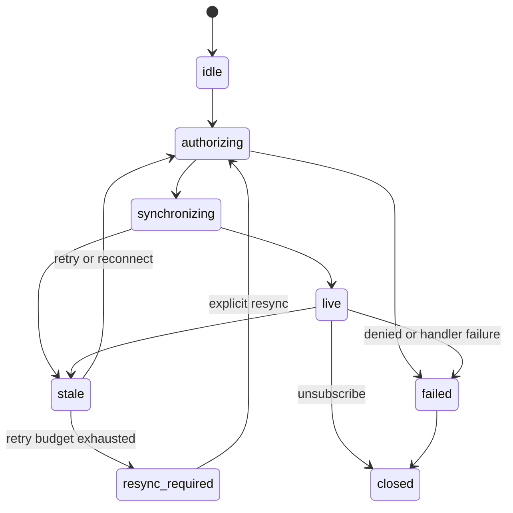

# StreamOtter V1 API specification

September 24, 2026 · Contract revision 0.2 · Implemented; see [implementation status](./IMPLEMENTATION_STATUS.md)

This specification makes the V1 scope in the [roadmap](./API_AND_FEATURE_ROADMAP.md) concrete. The runtime implements it: `packages/` contains the gateway, SDK, CLI, and shared contracts, and the [implementation status](./IMPLEMENTATION_STATUS.md) records what was verified and how. The public types are defined once in `@streamotter/contracts`; [contracts/v1/api.ts](../contracts/v1/api.ts) re-exports them together with the real `createClient`, `createGateway`, and `defineProject`, so the [application example](../contracts/v1/example.ts) and [negative type checks](../contracts/v1/type-tests.ts) compile against the implementation. Implementation decisions that refine this document are collected in [section 13](#13-implementation-refinements-contract-revision-02).

This document governs behavior; the declarations govern public types. Keep both consistent as implementation proceeds. The roadmap’s sketches are superseded where this specification refines them. The [implementation handoff](./IMPLEMENTATION_HANDOFF.md) specifies the build order.

## 1. Scope and selected foundations

V1 provides one Node.js gateway, Kafka and fixture sources, JSON state channels, a TypeScript browser SDK using Socket.IO, and a locally served workbench. Current-state replacement and authoritative snapshots are the only delivery mode. Durable event history, commands, multiple gateways, other transports, and team administration remain later work.

Target Node.js 24 for gateway development and current evergreen browsers for the SDK. Select KafkaJS **2.2.4** behind an internal adapter for the first implementation: its manual consumption/progress APIs match the required boundary and preserve KafkaSocks continuity. This is a deliberate initial dependency choice, not a claim about current maintenance health. Pin Socket.IO server/client to the same compatible 4.x release when installing them, and record exact versions in the lockfile. The contract uses Socket.IO’s protocol, not bare WebSocket. [KafkaJS release](https://github.com/tulios/kafkajs/releases/tag/v2.2.4), [consumption APIs](https://kafka.js.org/docs/consuming), [Socket.IO client options](https://socket.io/docs/v4/client-options/)

The first Kafka integration target is a pinned Apache Kafka 4.1.2 local container. Broker compatibility beyond the exercised version must be labeled unverified. Check client behavior against that broker during implementation before claiming support; a version target is not a compatibility result.

Initial connection modes are TLS with system trust or a supplied CA, optionally with SASL PLAIN or SCRAM SHA-256/SHA-512. Plaintext Kafka is development-only. No OAuth, mutual TLS, Schema Registry, or binary codecs in this contract. Production browser traffic terminates HTTPS/WSS at the deployment proxy; the gateway itself can serve HTTP behind it.

## 2. Configuration and generated application contracts

Canonical configuration is `streamotter.json`, loaded through `defineProject<C>()` or directly by the CLI. It contains `configVersion`, `projectId`, gateway settings, connection profiles, sources, schemas, channels, and optional limit overrides. The [complete example](../contracts/v1/example.ts) is the reference shape.

Configuration never embeds application functions. Each channel’s `handlersRef` resolves to the corresponding named entry in `HandlerRegistry.channels`; in V1 it must equal the channel name. The registry is supplied by trusted server code. `authenticate` is a gateway-level handler. There are no per-request uploads of handlers or executable configuration.

Identifiers (`projectId`, source/channel/schema/profile IDs) match `[A-Za-z][A-Za-z0-9_-]{0,63}`. Each channel has one deployed positive integer version. Requests must name that version exactly. V1 does not host two versions under the same name simultaneously; use a distinct channel name for an overlapping breaking migration. SDK package compatibility is separate from application channel versioning.

Only one distinct Kafka connection profile may be referenced by active sources in V1. Multiple bootstrap brokers for that cluster are valid. Each Kafka source specifies its topics, dedicated consumer group, JSON codec, and explicit `startFrom` policy for partitions without a committed offset. A group must not be shared with another application or gateway. Never create consumers per browser connection. Reject conflicting group definitions within the project; document that external misuse cannot be fully prevented by local validation.

Every source has an explicit `generation` identifier. Change it when recreating topics, changing cluster identity, or replacing fixture contents. Derive source-record IDs from a SHA-256 hash of the canonical tuple `(projectId, sourceId, generation, record position)`. Derive update-event IDs from source-record ID plus channel/version and mapped tenant/parameters/revision. Snapshot IDs are fresh UUIDs per attempt. These identities identify deliveries; they do not provide V1 replay. Mapping changes that alter public meaning require a channel-version change.

Credentials are environment references; CA files are local paths resolved relative to the configuration file. Missing secret references fail startup. Exports contain references, never resolved secrets. `defineProject()` validates the structure and references synchronously; actual credential resolution and connectivity belong to gateway startup. Unknown configuration keys and unsupported feature fields fail validation.

### Schemas and parameters

V1 supports the bounded schema subset expressed by `Schema` in the declarations: object properties/required fields with `additionalProperties: false`; strings with length/enum constraints; numbers/integers with bounds; booleans; null; and bounded arrays. Reject unsupported keywords rather than pretending to support all JSON Schema. No remote references, recursive schemas, regex patterns, unions, or schema registry lookups yet. Maximum schema/value nesting depth is 16. Integer values must be JavaScript-safe; non-finite numbers are invalid JSON data.

Parameter schemas are closed objects containing only required strings, booleans, or safe integers. No optional fields, nulls, arrays, or defaults in V1 parameters. Normalize `-0` to `0`, sort property keys, and JSON-encode validated values for canonical matching. Do not normalize string case or Unicode. Payload schemas may contain nested objects and arrays.

`streamotter generate` emits `AppChannels` containing each channel’s parameter type, payload type, and literal version. Numeric ranges and string lengths remain runtime checks. The hand-written `AppChannels` in the example stands in for this future generator. Type checking alone cannot verify that arbitrary schema definitions match manually written TypeScript types.

Revision is envelope metadata, not a configurable payload field. This replaces the roadmap’s `revisionField` sketch and avoids duplicate sources of truth.

## 3. Server handlers and gateway lifecycle

All handlers receive an `AbortSignal` and `requestId`. They must stop useful work when cancelled. The runtime ignores late results after timeout, unsubscribe, revocation, source discontinuity, or synchronization-generation change. A timeout does not allow a handler’s eventual result to restore access.

| Handler | Input beyond context | Return | Meaning |
| --- | --- | --- | --- |
| `authenticate` | Token and verified request origin | `Principal` or `null` | Verify identity; never trust client-supplied principal fields. |
| `authorize` | Verified principal and validated channel parameters | Boolean | Permit this principal to receive this channel instance. |
| `map` | Decoded `SourceRecord` | Array of `MappedState`, possibly empty | Select public state and its tenant/channel parameters. Empty means intentionally filtered. |
| `snapshot` | Verified principal and validated parameters | `{revision, data}` | Return authoritative full state for this instance. |

`Principal` requires `subject`, `tenantId`, `sessionId`, finite future `expiresAt` in UTC RFC3339, and JSON claims. Every routed update has an explicit `tenantId` supplied by the trusted mapper. Routing identity is `(projectId, channel, version, verified tenantId, canonical parameters)`. A browser cannot supply the tenant namespace.

All authorized readers of one routing identity must receive the same public state. A snapshot handler must not apply per-user redaction that the live mapper cannot reproduce. Use separate channel/parameter scopes for different public views. Validate mapped parameters, revisions, output count, and payloads before admitting any output from the source record.

`createGateway({config, handlers, mode, development?, configDir?, logger?})` constructs without opening connections. `configDir` resolves relative CA paths (default: the working directory); `logger` receives redacted operator diagnostics. `start()` opens the listener and consumers and resolves when every configured source is ready; on failure or a thirty-second startup deadline it rolls back resources started by that attempt and rejects. Repeated starts while starting share the same operation; a running start returns current address information. A stopped gateway cannot restart; construct a new instance.

`stop({timeoutMs})` defaults to ten seconds: stop new subscriptions, invalidate active subscriptions, abort handlers, stop consumers, commit only completed processing, close sockets, and release resources. It is idempotent. Deadline expiry forces closure without committing incomplete records.

`revoke(selector)` invalidates matching active subscriptions immediately and closes matching connections for session/subject selectors. Drop unsent frames and abort pending snapshots; already transmitted bytes cannot be recalled. The promise resolves after local invalidation, not after a browser acknowledges it. The application must update its durable authorization/session policy **before** calling this hook, so reconnection cannot restore revoked access. V1 does not persist a revocation database.

`resumeSource(sourceId)` retries a paused source at its uncommitted position after an operator fixes the cause. It never skips a poison record. Source readiness triggers a fresh synchronization for affected subscriptions.

## 4. Browser SDK

`createClient<C>({origin?, path?, getToken})` creates an idle client. `origin` defaults to the page origin; `path` defaults to `/streamotter/socket.io`. The namespace is `/`. Origin and transport path are intentionally separate, replacing the roadmap’s ambiguous `url` argument.

```ts
const client = createClient<AppChannels>({
  origin: "http://localhost:7400",
  getToken: ({ signal }) => session.getAccessToken(signal)
});
const order = client.subscribe("orderStatus", {
  channelVersion: 1,
  params: { orderId: "ord_123" }
});
order.on("data", event => renderOrder(event.data));
order.on("state", ({ state }) => showDeliveryState(state));
order.on("error", error => showStreamError(error));
await order.ready({ timeoutMs: 30_000 });
```

This short example assumes an application session and view functions. The contract repository includes a [fully type-checked example with those dependencies made explicit](../contracts/v1/example.ts).

`subscribe()` returns an independent, locally identified subscription immediately and schedules startup in the next microtask. Listeners attached synchronously cannot miss initial delivery. Creating two identical subscriptions creates independent handles and lifecycle; implementation may share internal work only if authorization and semantics remain identical. Snapshots must not be shared across principals in V1.

`on()` returns a removal function. State listeners receive subsequent changes; `.state` exposes current state. Data events are not replayed to late listeners. Synchronous callback exceptions and rejected callback promises become local `HANDLER_FAILED` errors and fail that subscription. Error-listener failures are caught and reported to a diagnostic logger without recursive error emission. Listener completion is not an application-processing acknowledgement.

`ready()` waits for the next `live` state, resolving immediately if already live. Defaults to 30 seconds. Each waiter has its own timeout/signal; cancelling a waiter does not cancel the subscription. Terminal failure or closure rejects pending waiters with a structured `StreamError`. `resync()` starts a new synchronization and waits under the same rules. Concurrent resync calls join one operation. A resync can recover `resync-required`; a failed/closed subscription must be replaced.

`unsubscribe()` cancels locally immediately and resolves after server acknowledgement or transport closure, capped at five seconds. It is idempotent. `close()` closes every subscription and the transport, releases timers, and makes the client permanently closed. Calls after close fail with `CLIENT_CLOSED`. Components should unsubscribe on unmount; close a shared client only when its owning application scope ends.

`reconnect()` obtains a new token, replaces the connection, and recreates active subscriptions with fresh snapshots. It is the explicit recovery action after `auth-required`; it does not resurrect failed/closed subscriptions. `getToken` has a ten-second timeout. Network failures retry with full jitter, starting at 500 ms and capped at 30 seconds, while there are active subscriptions. Authentication rejection suspends automatic retries. Refresh the connection 30 seconds before token expiry when possible; after expiry, delivery stops until reauthenticated.

The authenticated hello contains an opaque `identityKey` scoped to tenant and subject. If it changes on reconnect, close the prior subscriptions with `UNAUTHENTICATED`; callers create new subscriptions for the new identity. This prevents silently carrying a previous user’s view across an account switch.

## 5. States and synchronization

Connection states: `idle`, `connecting`, `connected`, `reconnecting`, `auth-required`, `closed`.

Subscription transitions:



The diagram abbreviates cleanup: unsubscribe/client close may enter `closed` from every state; a terminal validation/auth error may enter `failed` from any non-closed state. The wire spelling is `resync-required`.

### State consistency requirements

`revision` is a canonical unsigned decimal string matching `0|[1-9][0-9]{0,38}`. Compare numerically without conversion to JavaScript `number`. A revision is monotonically increasing within one routing identity and must not reset when an entity is recreated. Represent deletion as explicit full state in the payload schema; a Kafka tombstone has no implicit deletion semantics.

Snapshots and mapped events must represent the same domain state progression. Every change newer than the snapshot boundary must eventually enter the source. V1 expects one channel instance’s changes to arrive from one stable Kafka partition in revision order. It cannot infer upstream omissions or make a non-atomic database/event publication workflow atomic. The application must supply that consistency, for example through its existing transactional outbox.

### Exact synchronization sequence

1. Validate the channel/version and parameters, authenticate, and authorize. Create a new opaque epoch for this subscription.
2. Require the source to be ready. Register the subscription’s live capture before calling `snapshot`; buffer mapped updates under finite limits.
3. Call `snapshot`. Validate revision and payload. Recheck authorization and token validity immediately before delivering the snapshot.
4. Emit the snapshot as sequence 1 for this epoch. Wait for the SDK receipt, then release buffered full states newer than that revision in source order; discard older/equal revisions already represented by the snapshot.
5. After all buffered frames through a captured drain boundary have been received by the SDK, emit `live`. Continue with subsequent full state updates. `live` means synchronized to that boundary while the source is healthy; it is not proof of wall-clock freshness or application rendering.

Each retry starts a new epoch and discards the old generation’s pending frames and handler results. On source outage, consumer rebalance, transport loss, overflow, or snapshot timeout, emit `stale`, invalidate the generation, and resynchronize once prerequisites recover. Three synchronization attempts are allowed per incident, with one- then two-second backoff. Waiting for an unavailable source/transport does not repeatedly invoke snapshot handlers; an individual `ready()` wait still times out. Exhaustion enters `resync-required`.

For live updates, discard revisions older than the last accepted revision. Equal revisions with equal canonical data are duplicates; equal revisions with conflicting data produce `REVISION_CONFLICT`, pause the source, and mark its subscriptions stale. This is a comparison against current state, not a permanent database of every historical revision. Snapshots in the same client lifetime must not regress below its last accepted revision; report synchronization failure if they do.

## 6. Source progress, failures, and flow control

Kafka consumers use explicit progress management: auto-commit and automatic batch resolution are disabled. Process records in order within each partition and heartbeat while processing. Commit the next offset only after validation/mapping succeeds and each matching subscription either admits the state or has been explicitly invalidated for resynchronization. A record with no interested subscribers may be committed. A filtered record may be committed. A commit is never evidence of browser delivery.

Invalid JSON, unsupported tombstones, invalid mapped payloads/revisions, handler errors/timeouts, and revision conflicts pause the source without committing the failing record or any later position in its partition. Conservatively mark every subscription of that source stale. Do not busy-loop retry or silently skip. Emit a redacted operator diagnostic; resume only through the trusted server/management action after correction. Already admitted earlier records can repeat after a crash; state revisions make that harmless when the application contract is correct.

One slow subscription does not indefinitely hold Kafka progress: invalidate its pending generation, mark it stale, and apply its resynchronization policy. Slow transport receipt closes the connection so queued transport bytes cannot grow without bound. Other subscriptions continue. Never silently switch to data dropping while still reporting `live`.

### Proposed default limits

All configurable fields below are positive integers. They are starting bounds, not published capacity claims. Reject inconsistent limits, such as a frame larger than the per-subscription byte budget.

| Setting | Default |
| --- | ---: |
| `maxConnections` | 1,000 |
| `maxSubscriptionsPerConnection` | 50 |
| `maxSourceRecordBytes` | 1,048,576 |
| `maxDataFrameBytes` | 65,536 |
| `maxParamsBytes` | 4,096 |
| `maxPendingFramesPerSubscription` | 100 |
| `maxPendingBytesPerSubscription` | 1,048,576 |
| `maxPendingBytesPerConnection` | 4,194,304 |
| `maxPendingBytesGateway` | 67,108,864 |
| `maxMapOutputs` | 100 per record per channel |
| `maxConcurrentSnapshots` | 32 |
| `handlerTimeoutMs` | 2,000 |
| `snapshotTimeoutMs` | 10,000, including admission wait |
| `receiptTimeoutMs` | 5,000 |
| `maxSyncAttempts` | 3 |
| `maxTraceEntries` | 10,000 |
| `maxTraceBytes` | 8,388,608 |
| `maxControlFrameBytes` | 16,384 |
| `controlRequestsPerSecond` | 20 per connection, burst 40 |

Budgets count UTF-8 serialized envelopes, pending snapshots, buffered updates, and in-flight frames. The gateway-wide budget is enforced before copying/admission; it is not a bound on total process memory or native broker buffers. Configure broker fetch limits separately. Runtime objects, sockets, schemas, and traces need independent bounds and memory tests.

Only one data frame per subscription is in flight until receipt. Client receipts confirm SDK frame validation and admission to synchronous listener dispatch; returned promises are not awaited for receipt. V1 cannot guarantee that application-created async work remains bounded. The default SDK is intended for cheap state replacement; expensive processing belongs in the application’s own bounded workflow.

## 7. Authentication and access lifecycle

Socket auth is `{token, protocolVersion: 1}`. Tokens are sent in the Socket.IO authentication payload, not a URL query string. Require a nonempty token at most 8 KiB. Allow only exact configured origins; no wildcard production origins. V1 targets browsers and rejects a missing origin in production. Origin checks supplement identity verification; they are not authentication.

Authorize on subscribe, every resynchronization, and before each data-frame send. The `authorize` handler runs at subscribe, at every synchronization attempt, and again immediately before the snapshot is delivered; the check before every data frame is synchronous (connection open, token unexpired, subscription not revoked), because revocation invalidates matching subscriptions immediately. Recheck expiration and local revocation state after asynchronous authorization. Policy failure discards pending data and terminates the subscription. Exceptions fail closed. SDK receipt does not bypass these checks. A trusted mapper may broadcast within a tenant, but only individually authorized subscribers receive data.

Unrecognized channels/versions and unauthorized channel access all produce public `FORBIDDEN`. `CHANNEL_NOT_FOUND` and `CHANNEL_VERSION_UNSUPPORTED` are available only to trusted operators/local generated-contract diagnostics. Request identifiers and public messages must not reveal topic names, secrets, handler stack traces, or protected payloads.

## 8. Socket.IO protocol v1

Use namespace `/`, configurable HTTP path `/streamotter/socket.io`, and **WebSocket-only Socket.IO transport** initially. Disable Socket.IO connection-state recovery: V1 owns its snapshot lifecycle. The SDK owns reconnection and subscribes again only after an authenticated `so:hello`. Disable transport-layer buffering/retry of StreamOtter control requests while disconnected. This keeps lost-request behavior in one layer.

The [wire declarations](../contracts/v1/api.ts) define these events:

| Direction | Event | Contract |
| --- | --- | --- |
| Server → client | `so:hello` | Capabilities, connection ID, identity key, auth expiry; must arrive within ten seconds. |
| Client → server | `so:subscribe` | Request ID, client subscription ID, channel, version, parameters; Socket.IO callback returns acceptance/error. |
| Server → client | `so:state` | Subscription ID, epoch, state, optional reason. |
| Server → client | `so:data` | Subscription ID, epoch, sequence, event. |
| Client → server | `so:receipt` | Subscription ID, epoch, received sequence. |
| Client → server | `so:resync` | Request/subscription IDs; callback confirms resynchronization accepted. |
| Client → server | `so:unsubscribe` | Request/subscription IDs; callback confirms removal; already absent is success. |
| Server → client | `so:error` | Structured error and optional subscription/epoch context. |

Control callback envelopes are `{ok: true, requestId, data}` or `{ok: false, requestId, error}`. Acceptance does not resolve `ready()`; only `live` does. Send the subscribe acceptance callback before its state/data frames. Control callback timeout is five seconds; after ambiguity, reconnect and reconstruct active subscriptions rather than accumulating retries on the same connection.

Subscription IDs and request IDs are client-generated UUIDs; validate format and scope IDs to the authenticated connection. Repeating an identical subscription ID and contract is idempotent; changing its contract is `INVALID_REQUEST`. Coalesce repeated resync requests while one is running. Keep a bounded 256-entry, 60-second request-result cache per connection for identical control retries; conflicting reuse fails. Rate limits still apply to repeated requests.

Sequences begin at 1 within an epoch and increase by one; use safe integers and start a new epoch before exhaustion. The SDK accepts an epoch only after its ordered `synchronizing` state frame. Ignore data/receipts from older epochs. Duplicate receipts are harmless. Gaps or unexpected future receipts fail the affected subscription with `INVALID_REQUEST` and require a fresh synchronization; unsolicited subscription IDs do not allocate server state.

No cursor, history, command, or application acknowledgement messages exist in v1. Unknown operations/required capabilities receive `UNSUPPORTED_CAPABILITY`; do not silently downgrade them.

## 9. Errors

All API failures use the `StreamError` shape in the declarations. SDK promises reject with that structured object; event listeners receive the same shape. `retryable` describes whether another attempt under changed conditions can work, not permission for an infinite loop. Never retry `FORBIDDEN`, bad parameters, unsupported capabilities, or configuration errors automatically.

Public errors describe actions: “The source is unavailable; this view may be stale,” rather than broker internals. Operator traces may include source IDs and redacted coordinates, but no raw credentials or handler inputs.

Use `INVALID_PAYLOAD` for invalid source/mapped/snapshot data, `HANDLER_FAILED` for application code failure, `TIMEOUT` for a caller wait deadline, and `RESYNC_REQUIRED` when automatic synchronization is exhausted. `CANCELLED` applies to explicit cancellation; `CLIENT_CLOSED` to calls on a closed SDK. Unknown runtime faults become `INTERNAL` with a correlation ID.

## 10. Management API and workbench

Management starts only through `streamotter dev`, on `127.0.0.1:7401` by default. Production `start` does not expose it. Serve the workbench from that same origin. Issue a random per-run management token through the CLI startup output; users enter it in the workbench, which holds it in memory. Every `/management/v1` operation requires its bearer token. Browser requests must have the exact workbench origin, or, for same-origin GETs without `Origin`, a same-origin Referer. Non-browser CLI clients may omit both with the token. No cross-origin CORS access; no token in query strings.

All responses use the same `Result<T>` envelope. Successful operations return HTTP 200, including a configuration-validation report with `valid:false`. Malformed requests return 400; missing/invalid credentials 401; denied operations 403; unknown resources 404; conflicting source state 409; oversized bodies 413; rate limits 429; dependencies unavailable 503; handler deadline 504; unexpected faults 500. Responses include `Cache-Control: no-store` and `X-Request-Id`. Management request bodies are limited to 1 MiB; source checks have a ten-second deadline and at most two concurrent operations.

The `ManagementOperations` interface defines exact request and response bodies for all routes. GET `request` fields are query parameters, validated from strings; null means no query/body is accepted. Route behaviors:

| Route | Additional behavior |
| --- | --- |
| `GET /capabilities` | Return supported versions/operations; no inferred future capabilities. |
| `GET /health` | Return 200 even when `ready:false`; list degraded/paused sources. |
| `GET /sources` | Return source IDs/types/status, never resolved secrets. |
| `GET /channels` | Return deployed contract summaries. |
| `GET /config` | Return active portable configuration and SHA-256 fingerprint of canonical JSON. |
| `POST /source-checks` | Check an existing source/profile reference; report staged failures. Do not accept arbitrary destination URLs. |
| `POST /config/validate` | Structural/schema/reference checks; never run handlers or connect to brokers. |
| `POST /config/export` | Validate and return canonical JSON content and fingerprint; do not write/apply it server-side. |
| `GET /traces` | Default 100, maximum 500 items; opaque cursor and bounded in-memory retention. Expired cursor returns 410 with `TRACE_CURSOR_EXPIRED`. |
| `POST /sources/resume` | Trusted retry at the same uncommitted position. Already healthy is a no-op. |
| `POST /preview-sessions` | Mint a five-minute token for a pre-registered development principal; do not accept arbitrary identity claims. |
| `POST /dev/fixtures/advance` | Advance 1–100 records of a named fixture source; no Kafka publishing or arbitrary payload injection. |
| `POST /dev/disconnect` | Disconnect only the named preview session; never arbitrary application connections. |
| `GET /dev/principals` | List registered development principal refs with their tenant and subject (added in revision 0.2 so the workbench can offer them); no claims. |

Every route above is prefixed `/management/v1`. Unknown body/query keys fail validation. Trace pagination uses an ephemeral sequence scoped to the gateway run; it is not a data-recovery cursor. Traces retain metadata only in V1. No payload capture is exposed.

Development principals and fixture records are provided through `createGateway.development`, not portable production configuration. Fixture records advance deterministically in array order. Preview tokens use the same authorization/snapshot/delivery path after the development identity resolver establishes their principal. Reject the `development` option in production. Preview creation returns `previewSessionId`, a separate preview handle used by the dev disconnect operation; it is not an arbitrary application session identifier.

Configuration edits are candidates until exported and restarted. The workbench must show the active fingerprint and restart requirement. It cannot imply that editing a form changed the running gateway.

## 11. CLI contract

| Command | Behavior |
| --- | --- |
| `streamotter init <directory>` | Create config, server-handler entry, schemas/example, and development fixtures. Refuse to overwrite existing files. |
| `streamotter validate --config <path>` | Validate portable config; no network or handler execution. |
| `streamotter generate --config <path> --out <directory>` | Generate channel types and integration examples; only overwrite files bearing the generator’s manifest. |
| `streamotter dev --config <path> --handlers <module>` | Start the gateway, local workbench, management session, and registered development fixtures. |
| `streamotter start --config <path> --handlers <module>` | Start gateway delivery only in production mode. |

The trusted handler module exports `handlers` and optional `development`. V1 loads compiled JavaScript modules; TypeScript examples are compiled by the application. No implicit runtime transpilation. Exit codes: 0 success, 2 invalid input/configuration, 1 startup/runtime failure. SIGINT/SIGTERM invoke graceful shutdown. Initialization can use a fixture-only project with empty Kafka connections; production refuses fixture sources.

## 12. Acceptance scenarios and current verification

Implementation must exercise these behaviors with deterministic fixtures and, for source progress, real Kafka:

1. A typed authorized subscription receives a snapshot before any update and reaches `live` after the drain boundary.
2. An update arriving during snapshot loading is applied exactly according to revision comparison, including a snapshot already ahead of that update.
3. An overflowing buffer or source restart invalidates the epoch; old snapshots and frames cannot restore `live`.
4. Unauthorized cross-tenant routing, expired tokens, and revoked access fail closed, including revocation while authorization/snapshot is pending.
5. A stalled client respects byte/frame budgets, is disconnected, and does not block healthy clients or grow broker-processing queues indefinitely.
6. A poison record pauses without advancing its partition; retry after correction processes that same record. A crash after admission but before commit does not regress displayed state.
7. Subscription cleanup, reconnect, concurrent resync, account switch, and handler failure release resources and obey their state contracts.
8. Workbench/CLI exports agree; production exposes neither management nor development actions; trace output omits credentials and payloads.
9. Unsupported V2/V3 options fail clearly. Source and channel names remain separate. Generated contract types agree with schema validation.

**Current verification:** every scenario above has automated coverage: fixture-backed integration tests for scenarios 1–5, 7–9 and the fixture half of 6; real-Kafka tests (Apache Kafka 4.1.2, KafkaJS 2.2.4) for offsets, poison records, crash/redelivery, rebalance, outage, TLS/SASL modes, and the production build. Commands, actual results, and remaining limitations are in [IMPLEMENTATION_STATUS.md](./IMPLEMENTATION_STATUS.md).

## 13. Implementation refinements (contract revision 0.2)

These decisions were made while implementing V1. They refine the text above; where they add types, `@streamotter/contracts` is authoritative.

**Types.** `GatewayOptions` (with optional `configDir` and `logger`), `GatewayLogger`, `DevelopmentOptions`, `Hello`, `ErrorFrame`, and `DevelopmentPrincipalSummary` are named exports. `ManagementOperations` gains `GET /management/v1/dev/principals`.

**Handshake.** The origin check and authentication run in Socket.IO handshake middleware, so rejections reach the SDK as structured `connect_error` data. `authenticate` returning `null`, a missing/oversized token, or an expired principal is `UNAUTHENTICATED` (not retryable). A handler exception, timeout, or malformed principal is `HANDLER_FAILED` (retryable; logged for the operator). Extra authentication fields are `INVALID_REQUEST`; another protocol version is `UNSUPPORTED_CAPABILITY`. `identityKey` is a truncated SHA-256 of project, tenant, and subject, so it is stable across gateway restarts and changes only when the account changes.

**State frames.** The gateway sends `synchronizing` with each new epoch, then `live`, `stale`, `resync-required`, and `failed`. Retries announce `authorizing` under the previous epoch (or `""` before the first). A client `so:resync` coalesces with an attempt that has not yet sent its snapshot, expedites a pending backoff, and starts a new epoch when the snapshot for the current epoch was already sent. Subscribe requests carrying unknown fields (for example `recovery`) are rejected with `UNSUPPORTED_CAPABILITY`. Unknown events are answered with `UNSUPPORTED_CAPABILITY` through their callback or `so:error`.

**Failure classes.** `authorize` returning anything but `true` fails the subscription with `FORBIDDEN`; `authorize` or `snapshot` throwing fails it with `HANDLER_FAILED`; an invalid or oversized snapshot fails it with `INVALID_PAYLOAD`. Authorization or snapshot timeouts, overflow, and receipt protocol violations are retryable attempt failures (`stale`, then one- and two-second backoff, then `resync-required`). A snapshot older than state already delivered on that subscription is also a retryable failure. Waiting for an unavailable source consumes no attempt. Public stale reasons for any source problem are `SOURCE_UNAVAILABLE`; the specific operator cause (for example `REVISION_CONFLICT`) appears in `SourceStatus.reason` and traces.

**Source progress.** The Kafka adapter commits the next offset after each record completes processing. A poison record pauses every topic of the source and seeks back so `resumeSource` retries that record; the fixture source retries it immediately on resume. Rebalance, consumer crash, and 12 seconds without fetch/heartbeat activity mark the source degraded. KafkaJS sockets are tracked and closed on stop, and a narrow, version-guarded fix for a KafkaJS 2.2.4 request-queue timer spin is applied inside the adapter (see the status document).

**SDK.** `subscribe()` after `close()` throws `CLIENT_CLOSED`. `ready()` also rejects when the subscription enters `resync-required` (`RESYNC_REQUIRED`) or the client enters `auth-required` (`UNAUTHENTICATED`). A `getToken` failure or timeout suspends the client in `auth-required`. Handshake rejections with `UNAUTHENTICATED`, `FORBIDDEN`, `INVALID_REQUEST`, or `UNSUPPORTED_CAPABILITY` suspend automatic retries; other failures retry with full jitter. A subscribe rejected with `OVERLOADED` (rate or subscription limit) retries after one and two seconds, then enters `resync-required`. SDK-detected violations (sequence gaps, wrong kinds, revision regressions) are reported as errors and trigger at most three fresh synchronizations per incident before `resync-required`. Any frame for a subscription proves the gateway holds it, even before the subscribe acknowledgement's continuation runs.

**Management and workbench.** Unknown resources return 404 with code `INVALID_REQUEST` (the error vocabulary has no generic not-found code). Without a cursor, `GET /traces` returns the newest `limit` matching traces oldest-first; `nextCursor` is always a position after the last examined trace so callers can poll. The management server injects the gateway origin into the workbench page as a meta tag (never the token) and serves it with a restrictive CSP. Source checks also work for a source that failed to start, and `streamotter dev|start` print them when startup fails.

**CLI imports** (added with the all-in-one `streamotter` package in `0.1.0-rc.3`). `init` and `generate` pick the import source for the code they write: `streamotter/client` and `streamotter/gateway` when the nearest `package.json` lists `streamotter` and not `@streamotter/client`, and `@streamotter/client` and `@streamotter/gateway` otherwise. Configuration fingerprints don't depend on it.
